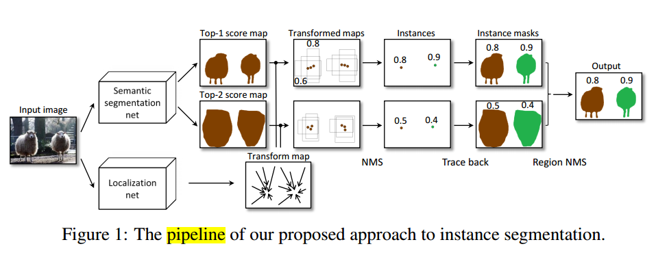
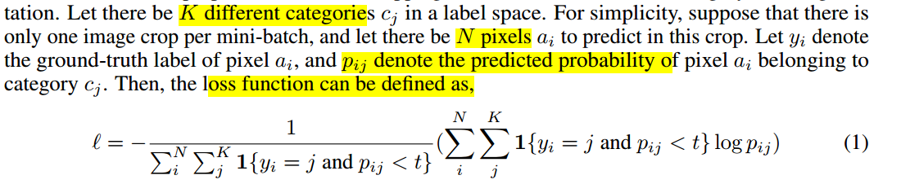
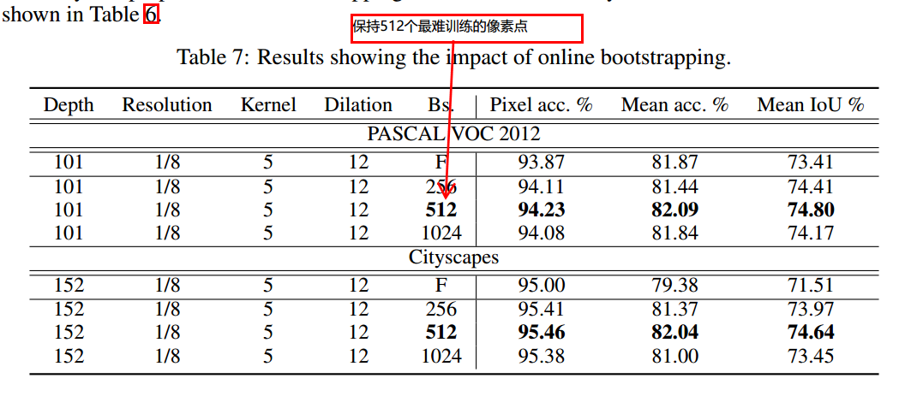

* [paper](paper/2016-Bridging%20Category-level%20and%20Instance-level%20Semantic%20Image%20Segmentation.pdf)

#### 动机

* 以前的方法第一阶段基于FPN，网络结构复杂，它的表现似乎关键取决于实例数的正确预测，这有时是不可行的。

#### 贡献

1. 提出一种简单有效的语义实例分割方法；
2. 我们提出一种在训练阶段在线的boostrap方法，提高难分样本的准确率。
3. 因为语义类别分割在实例分割方面有重要的影响，在我们的第二部，我们训练全卷机残差网络来获得更好的语义分类分割效果。

#### 提出的方法

##### 1. 实例分割的推荐管道

* 步骤
  1. 计算类别分数图通过语义类别分割；
  2. 计算类别转换图通过bounding box回归
  3. 使用获得的转换图到它们对应的分数图
  4. 在转换图上通过非极大值抑制寻找局部最大值，作为实例假设；
  5. 追溯所有抑制像素并恢复每个实例假设的掩码；
  6. 生成最后的实例分割结果通过NMS。

* 两个网络分开训练，语义分割网络通过经典的逻辑回归损失，定位网络通过smooth l1损失；

##### 2. 在线bootstrapping 对于难训练的像素

* 我们提出在线bootstrapping方法，强迫网络关注难分像素点；
* 损失函数：

* t控制难分的类别，但是如果的时候每个批次像素点要保持一定规模，不然计算梯度将变得很噪声，因此，如果我们目前的模型表现良好就增加t，如果模型表现不好就减少。
* 在定位网络中，在线bootstrapping思路一样，但是我们定义容易有点不一样的方式，这里，我们阈值IoU分数（ground-truth和预测的bounding box），而不是直接阈值回归损失。我们的直觉是我们不关心准确的高和宽或者偏移，我们关心我们是否可以得到正确的实例在NMS操作之后。因为NMS基于IoU的分数，所以我们选择比阈值回归损失四个目标变量更自然。

##### 3. 全卷积残差网络

* FCN模式
* ResNet特征提取
* 后面使用空洞卷积

### 实验

#### 在线boostrapping对于难训练像素点的重要性

* 保持512个困难训练像素点，有提升但是效果不是很大，2%提升；

